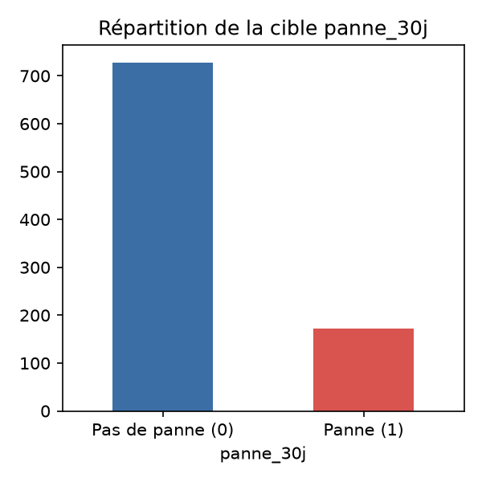
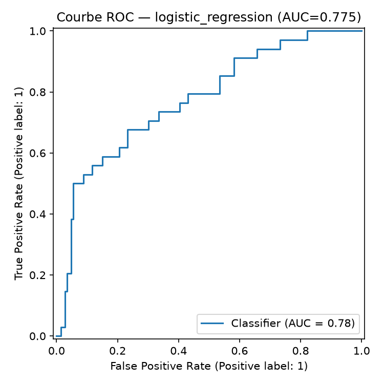
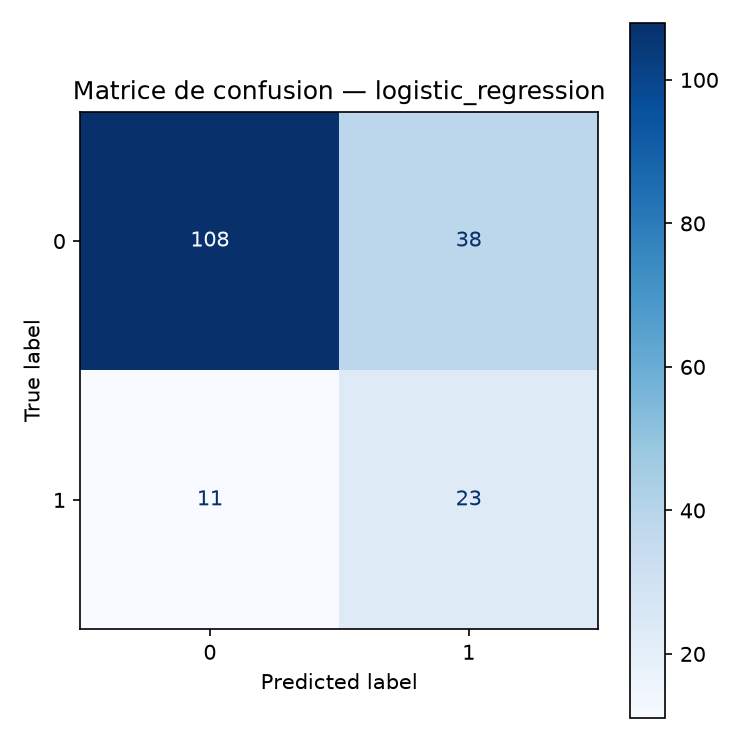
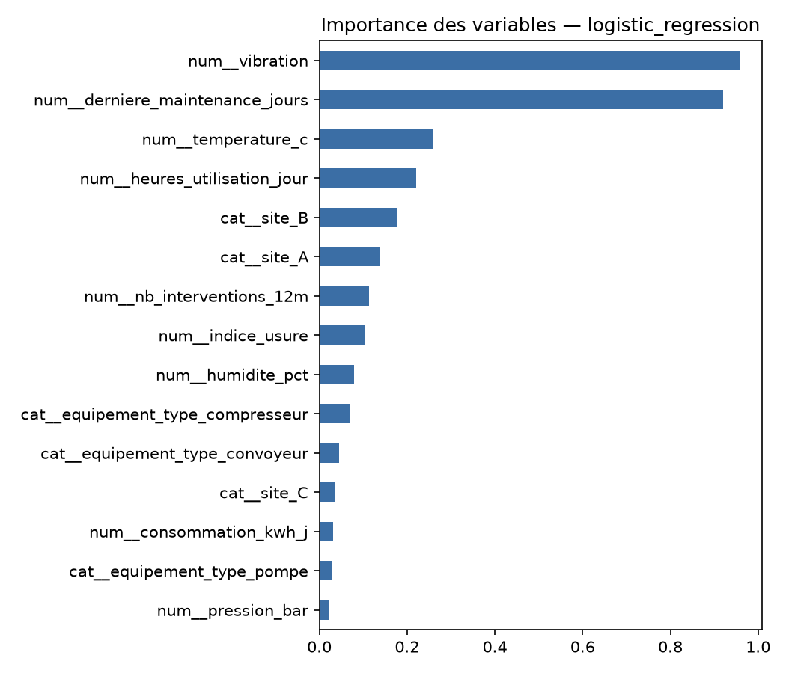

# Maintenance prédictive des équipements

> **Prédire le risque de panne dans les 30 prochains jours à partir de données de capteurs industriels.**

Projet de data science de bout en bout, réalisé en Python et scikit-learn. Il transforme des mesures imparfaites en un pipeline reproductible de préparation des données, d'apprentissage supervisé et d'évaluation métier.



## Sommaire

- [Objectifs](#objectifs)
- [Résultats](#résultats)
- [Visualisations](#visualisations)
- [Pipeline](#pipeline)
- [Données](#données)
- [Installation et utilisation](#installation-et-utilisation)
- [Structure du projet](#structure-du-projet)
- [Choix techniques](#choix-techniques)
- [Limites et prochaines étapes](#limites-et-prochaines-étapes)

## Objectifs

Le projet répond à une question opérationnelle : **quels équipements présentent un risque élevé de panne à court terme ?**

Il met l'accent sur :

- la fiabilité des données avant la modélisation ;
- la prévention de la fuite de données ;
- la prise en compte du déséquilibre entre pannes et non-pannes ;
- la reproductibilité des résultats et des artefacts générés.

Le dépôt constitue un projet pédagogique et de portfolio. Il ne remplace pas une validation sur des données industrielles réelles.

## Résultats

Le modèle est sélectionné par validation croisée stratifiée à 5 folds, puis évalué sur un jeu de test indépendant de 180 observations. Les résultats sont disponibles dans [`outputs/metrics/metrics.json`](outputs/metrics/metrics.json).

| Indicateur | Résultat |
| --- | ---: |
| Modèle retenu | Régression logistique pondérée |
| ROC-AUC moyenne en validation croisée | **0,762 ± 0,037** |
| ROC-AUC sur le jeu de test | **0,775** |
| Accuracy sur le jeu de test | 0,728 |
| Précision de la classe `panne` | 0,377 |
| Rappel de la classe `panne` | **0,676** |
| F1-score de la classe `panne` | 0,484 |

Le rappel de **0,676** indique que le modèle détecte environ deux pannes sur trois dans l'échantillon de test. La précision plus faible implique des faux positifs : ce compromis peut être pertinent lorsqu'une inspection préventive coûte moins cher qu'une panne non anticipée.

## Visualisations

### Performance de classification

| Courbe ROC | Matrice de confusion |
| --- | --- |
|  |  |

### Compréhension des données et du modèle

| Importance des variables | Répartition de la cible |
| --- | --- |
|  |  |

## Pipeline

```text
Données CSV brutes
        |
        v
Normalisation des colonnes et conversion des décimales françaises
        |
        v
Imputation des valeurs manquantes + détection IQR des outliers
        |
        v
Split train/test stratifié
        |
        v
Standardisation + encodage one-hot dans un Pipeline scikit-learn
        |
        v
Comparaison régression logistique / random forest
        |
        v
Evaluation, métriques JSON et figures PNG
```

Les valeurs aberrantes sont conservées et signalées dans `outlier_flag` : une mesure extrême peut être un signal de dégradation utile à la maintenance.

## Données

Le fichier [`data/raw/mini_etudiant_13_panne_equipement.csv`](data/raw/mini_etudiant_13_panne_equipement.csv) contient **900 observations** simulées, réparties sur trois sites et trois types d'équipements : pompe, convoyeur et compresseur.

| Famille | Variables |
| --- | --- |
| Capteurs | température, vibration, humidité, pression, consommation |
| Usage et historique | heures d'utilisation, alertes récentes, maintenance, interventions, indice d'usure |
| Catégories | `site`, `equipement_type` |
| Cible | `panne_30j`, indicateur binaire d'une panne dans les 30 jours |

Le jeu nettoyé est généré dans [`data/processed/panne_equipement_clean.csv`](data/processed/panne_equipement_clean.csv). Il contient 900 lignes et 14 colonnes, dont `outlier_flag`.

## Installation et utilisation

### Installation

Prérequis : Python 3.11 ou une version compatible avec les dépendances du projet.

```bash
git clone https://github.com/Adam01-i/predictive-maintenance-panne-equipement.git
cd predictive-maintenance-panne-equipement

python3 -m venv .venv
source .venv/bin/activate
python -m pip install --upgrade pip
python -m pip install -r requirements.txt
```

Sous Windows :

```powershell
.venv\Scripts\Activate.ps1
```

### Exécuter le pipeline

Depuis la racine du dépôt :

```bash
python -m src.pipeline
```

La commande réalise le nettoyage, l'entraînement, l'évaluation et la génération des fichiers dans `outputs/`.

Pour suivre l'analyse pas à pas, ouvrir les notebooks dans cet ordre :

1. [`notebooks/01_exploration_nettoyage.ipynb`](notebooks/01_exploration_nettoyage.ipynb)
2. [`notebooks/02_modelisation.ipynb`](notebooks/02_modelisation.ipynb)

### Lancer les tests

```bash
python -m pytest tests/ -v
```

Les tests couvrent notamment les décimales françaises, les valeurs manquantes, les doublons, le type de la cible et le signal d'outlier.

## Structure du projet

```text
.
├── data/
│   ├── raw/                 # données originales
│   └── processed/           # données nettoyées générées
├── notebooks/               # exploration et modélisation guidées
├── outputs/
│   ├── figures/             # visualisations PNG
│   └── metrics/             # métriques au format JSON
├── src/
│   ├── data_cleaning.py     # chargement et qualité des données
│   ├── modeling.py          # entraînement, évaluation et figures
│   └── pipeline.py          # orchestration de bout en bout
├── tests/                   # tests de non-régression
├── requirements.txt
└── LICENSE
```

## Choix techniques

- Conversion de la virgule décimale avant toute coercition numérique.
- Imputation par médiane pour les variables numériques et par mode pour les catégories.
- Suppression des lignes dont la cible est invalide, sans imputation de `panne_30j`.
- Préprocesseur ajusté uniquement sur le jeu d'entraînement pour éviter la fuite de données.
- `StandardScaler` pour les variables numériques et `OneHotEncoder` pour les catégories.
- `class_weight="balanced"` pour tenir compte du déséquilibre des classes.
- Comparaison de la régression logistique et de la random forest selon la ROC-AUC.
- `random_state=42` pour rendre l'expérience reproductible.

## Limites et prochaines étapes

Le jeu de données est synthétique, de taille limitée et représente un instantané plutôt qu'une série temporelle par équipement. Les métriques ne constituent donc pas une garantie de performance en production.

Pistes d'amélioration :

- collecter des historiques horodatés par équipement ;
- calibrer le seuil de décision selon le coût des faux négatifs et faux positifs ;
- ajouter une recherche d'hyperparamètres et une validation temporelle ;
- suivre la dérive des données et comparer le modèle à une règle métier simple ;
- valider le modèle sur des données terrain avant tout usage opérationnel.

## Licence

Projet distribué sous licence MIT. Voir [`LICENSE`](LICENSE).
